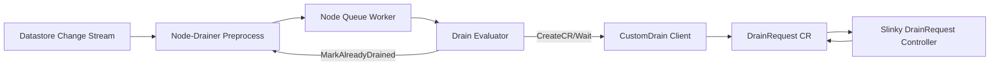

# Skills-Playground Architecture - Slinky Drainer + Node Drainer
In scope: `plugins/slinky-drainer/pkg/controller/drainrequest_controller.go`, node drainer component (`main`, `reconciler`, `evaluator`, `queue`, `customdrain`)
Out of scope: direct informer internals, datastore backend internals, upstream operators/controllers outside listed components

## TL;DR
System: Node-drainer consumes quarantine health events and delegates custom drain execution through `DrainRequest` handled by slinky-drainer.
Core loop: node-drainer reads change events, marks `InProgress`, enqueues by node, evaluates action, then updates datastore/node state from execution outcome.
Key flows: Quarantine -> create/poll `DrainRequest` -> `DrainComplete=True` -> `AlreadyDrained` | Cancelled/UnQuarantined -> cancel work -> mark terminal status and clear drain markers.

## 1) Architecture Map
| Actor | Action | Reason / Details | Evidence |
| --- | --- | --- | --- |
| `CRD` `DrainRequest` | reads spec fields -> carries drain intent -> writes completion condition | Holds node target and health-event context, and exposes completion for polling by node-drainer custom-drain flow. | (`plugins/slinky-drainer/api/v1alpha1/types.go:30`), (`plugins/slinky-drainer/api/v1alpha1/types.go:45`) |
| `Controller` `DrainRequestReconciler` | reads `DrainRequest` -> decides progress/finalizer path -> writes node annotation + `DrainComplete` | Adds finalizer, annotates node for cordon intent, waits for Slinky pod drain state, deletes Slinky pods, and marks completion. | (`plugins/slinky-drainer/pkg/controller/drainrequest_controller.go:81`), (`plugins/slinky-drainer/pkg/controller/drainrequest_controller.go:210`), (`plugins/slinky-drainer/pkg/controller/drainrequest_controller.go:301`), (`plugins/slinky-drainer/pkg/controller/drainrequest_controller.go:370`) |
| `Service` `Node-Drainer Bootstrap` | reads config/startup state -> starts watchers/workers -> writes event handoff to reconciler | Wires datastore watcher, informer cache, queue worker, and cold-start event replay. | (`node-drainer/main.go:123`), (`node-drainer/main.go:135`), (`node-drainer/main.go:227`) |
| `Service` `Node-Drainer Reconciler` | reads health-event updates -> decides skip/cancel/process -> writes datastore status + node labels | Performs preprocess state transitions, executes evaluator-selected actions, and owns terminal status updates/cleanup. | (`node-drainer/pkg/reconciler/reconciler.go:131`), (`node-drainer/pkg/reconciler/reconciler.go:212`), (`node-drainer/pkg/reconciler/reconciler.go:316`), (`node-drainer/pkg/reconciler/reconciler.go:574`) |
| `Service` `Drain Evaluator` | reads event/node/custom-drain state -> decides `Skip`/`Wait`/`CreateCR`/`MarkAlreadyDrained` -> writes action decision | Central decision point for whether to continue waiting, create a custom drain resource, or finalize as drained. | (`node-drainer/pkg/evaluator/evaluator.go:56`), (`node-drainer/pkg/evaluator/evaluator.go:91`), (`node-drainer/pkg/evaluator/evaluator.go:357`), (`node-drainer/pkg/evaluator/evaluator.go:385`) |
| `Service` `Queue Worker` | reads node-scoped queue item -> calls process -> writes retry via rate-limited requeue | Ensures failed processing gets retried with backoff instead of dropping work. | (`node-drainer/pkg/queue/worker.go:41`), (`node-drainer/pkg/queue/worker.go:52`), (`node-drainer/pkg/queue/worker.go:62`) |
| `Integration` `CustomDrain Client` | reads template/config -> creates/gets/deletes CR -> writes completion check result | Bridges node-drainer action to an external controller by managing unstructured custom drain resources. | (`node-drainer/pkg/customdrain/client.go:92`), (`node-drainer/pkg/customdrain/client.go:171`), (`node-drainer/pkg/customdrain/client.go:210`) |
| `External` `Datastore + Node API` | reads status/annotation updates -> triggers next reconcile/event cycle -> writes observed state | Datastore change stream triggers node-drainer; node annotations/labels represent drain state consumed by controllers. | (`node-drainer/main.go:227`), (`node-drainer/pkg/reconciler/reconciler.go:224`), (`plugins/slinky-drainer/pkg/controller/drainrequest_controller.go:234`) |

## 2) Common Flow(s)
### Scenario A: Quarantine to custom drain completion
| Step | Object | Object Context (field/path + tiny snippet) | Actor | Action | Reason / Details | Evidence |
| --- | --- | --- | --- | --- | --- | --- |
| 1 | Health event record | `healthEvent.status` e.g. `AlreadyQuarantined` from change stream | `Service` `Change Stream Watcher` | reads event, calls preprocess/enqueue | Bring DB event into drain loop. | (`node-drainer/main.go:227`), (`node-drainer/main.go:239`) |
| 2 | Health event status + node work item | `healtheventstatus.userpodsevictionstatus: InProgress` and queue key by node | `Service` `Node-Drainer Reconciler` | writes `InProgress`, enqueues node item | Mark active and schedule work. | (`node-drainer/pkg/reconciler/reconciler.go:212`), (`node-drainer/pkg/reconciler/reconciler.go:236`) |
| 3 | Node queue item | workqueue item for one node, retried on error | `Service` `Queue Worker` | dequeues item, calls process, requeues on error | Keep work moving with retries. | (`node-drainer/pkg/queue/worker.go:42`), (`node-drainer/pkg/queue/worker.go:62`) |
| 4 | Custom drain CR state | `crName := GenerateCRName(node,eventID)`; `Exists(crName)`; `GetCRStatus(crName)` | `Service` `Drain Evaluator` | decides `CreateCR` or `Wait` | Missing CR -> create. Existing but not complete -> wait. | (`node-drainer/pkg/evaluator/evaluator.go:323`), (`node-drainer/pkg/evaluator/evaluator.go:357`) |
| 5 | `DrainRequest` CR | `spec.nodeName`, `spec.healthEventID`, `spec.podsToDrain` | `Integration` `CustomDrain Client` | renders template, creates CR, returns identity | Hand drain execution to slinky-drainer. | (`node-drainer/pkg/reconciler/reconciler.go:806`), (`node-drainer/pkg/customdrain/client.go:92`) |
| 6 | `DrainRequest` status + node annotation | `status.conditions[type=DrainComplete]=True` after Slinky pod drain | `Controller` `DrainRequestReconciler` | annotates node, drains/deletes Slinky pods, sets `DrainComplete=True` | Publish custom-drain completion. | (`plugins/slinky-drainer/pkg/controller/drainrequest_controller.go:301`), (`plugins/slinky-drainer/pkg/controller/drainrequest_controller.go:383`) |
| 7 | Datastore terminal status | `healtheventstatus.userpodsevictionstatus: AlreadyDrained` | `Service` `Drain Evaluator + Reconciler` | reads completion, marks `AlreadyDrained` | Close the event lifecycle. | (`node-drainer/pkg/evaluator/evaluator.go:385`), (`node-drainer/pkg/reconciler/reconciler.go:512`) |

### Scenario B: Cancellation and recovery cleanup
| Step | Actor | Action | Reason / Details | Evidence |
| --- | --- | --- | --- | --- |
| 1 | `Service` `Node-Drainer Reconciler` | reads `Cancelled`/`UnQuarantined` event -> decides cancellation path -> writes in-memory cancel markers | Prevents further drain work for stale or reverted events. | (`node-drainer/pkg/reconciler/reconciler.go:175`), (`node-drainer/pkg/reconciler/reconciler.go:190`), (`node-drainer/pkg/reconciler/reconciler.go:657`) |
| 2 | `Service` `Node-Drainer Reconciler` | reads cancellation marker during processing -> skips/aborts drain action -> writes terminal status | Stops timeout/eviction work when cancellation is active. | (`node-drainer/pkg/reconciler/reconciler.go:423`), (`node-drainer/pkg/reconciler/reconciler.go:449`), (`node-drainer/pkg/reconciler/reconciler.go:774`) |
| 3 | `Integration` `CustomDrain Client` | reads cancellation context -> deletes custom drain CR -> writes cleanup result | Removes external drain resource to avoid orphaned drain operations. | (`node-drainer/pkg/reconciler/reconciler.go:791`), (`node-drainer/pkg/customdrain/client.go:171`) |
| 4 | `Service` `Node-Drainer Reconciler` | reads cleanup completion -> removes node draining label -> writes final status (`Cancelled`/`Succeeded`) | Clears node drain markers and converges event state. | (`node-drainer/pkg/reconciler/reconciler.go:793`), (`node-drainer/pkg/reconciler/reconciler.go:399`), (`node-drainer/pkg/reconciler/reconciler.go:552`) |
| 5 | `Controller` `DrainRequestReconciler` | reads completed/deleting `DrainRequest` -> removes cordon annotation when safe -> writes finalizer removal | Restores node annotation state and allows CR deletion finalization. | (`plugins/slinky-drainer/pkg/controller/drainrequest_controller.go:147`), (`plugins/slinky-drainer/pkg/controller/drainrequest_controller.go:151`), (`plugins/slinky-drainer/pkg/controller/drainrequest_controller.go:169`) |

## 3) Diagram

## 4) Unknowns / Confidence
Confidence: medium.
- Source files for this scope are not present in this checkout, so evidence is referenced from existing repo architecture docs and retained file/line citations rather than direct source re-validation.
- Unknown: lifecycle owner that deletes completed `DrainRequest` objects after `DrainComplete=True` is outside this scoped surface.
